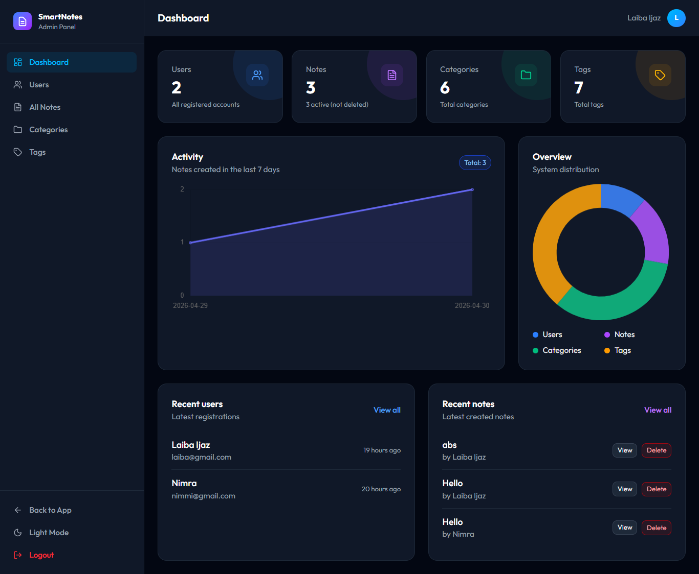
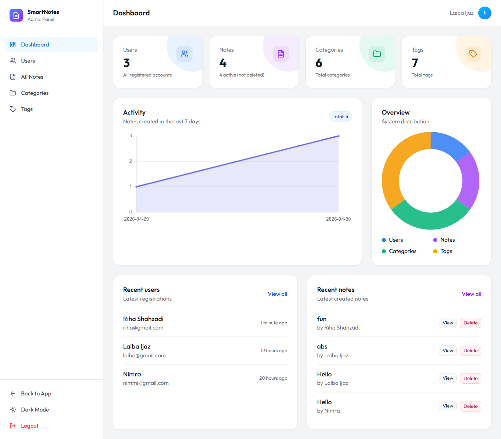
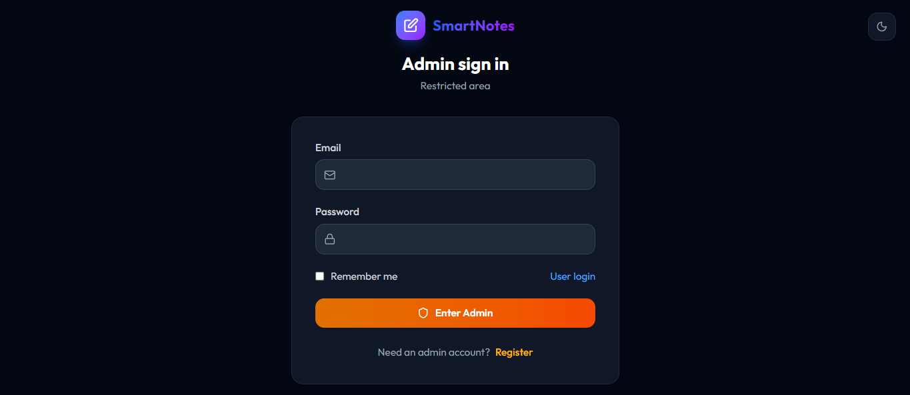

# 🧠 Smart Notes App with Advanced Admin Dashboard

A complete **Smart Notes Management System** built with **Laravel & MySQL**, featuring an intuitive user experience, powerful organization tools, and a fully functional **Admin Dashboard** for monitoring and control.

---

## 📌 🔗 Demo

🎥 **Watch Full Project Demo:**  
👉 https://youtu.be/5vjn0xql4mw

---

## ✨ Key Features

### 👤 User Panel

* 🔐 Secure Authentication (Register, Login, Logout)
* 📝 Create, Edit, Delete Notes (CRUD)
* 📌 Pin important notes
* ❤️ Mark notes as favorites
* 🎨 Color coded notes
* 🗑️ Trash system (Soft delete & restore)
* 📂 Category management (Many-to-Many)
* 🏷️ Tag system for flexible organization
* 🔍 Advanced search (title & content)
* 🎯 Smart filtering (Pinned, Favorites, Categories, Tags)
* 🔄 Sorting (Newest, Oldest, Alphabetical)
* ✍️ Rich Text Editor (bold, lists, headings)
* 📊 Live word count
* 📤 Export notes as PDF & TXT
* 🌙 Dark / Light mode toggle
* 👤 Profile management

---

### 🛠️ Admin Panel

* 🔐 Separate Admin Authentication
* 📊 Dashboard with system insights
* 👥 Manage all users
* 🚫 Block / Unblock users
* ❌ Delete user accounts
* 📝 View all user notes
* 🛡️ Content moderation (delete inappropriate notes)
* 🏷️ Manage categories & tags
* 📈 Platform analytics:
  * Total Users 👥
  * Total Notes 📝
  * Activity tracking 📊

---

## 📸 Screenshots

### 👤 User Panel


---

### 🔐 Admin Panel






---

## 🛠️ Tech Stack

* 💻 Frontend: Blade, HTML, CSS, JavaScript
* ⚙️ Backend: Laravel (PHP)
* 🗄️ Database: MySQL
* 🎨 Styling: Tailwind CSS
* 📦 Build Tool: Vite

---

## 📂 Project Structure

```bash
project root
├── app
│   ├── Http
│   │   ├── Controllers
│   │   │   ├── Admin
│   │   │   │   ├── AdminDashboardController.php
│   │   │   │   ├── AdminNoteController.php
│   │   │   │   └── AdminUserController.php
│   │   │   ├── Auth
│   │   │   │   ├── LoginController.php
│   │   │   │   └── RegisterController.php
│   │   │   ├── CategoryController.php
│   │   │   ├── Controller.php
│   │   │   ├── ExportController.php
│   │   │   ├── NoteController.php
│   │   │   ├── ProfileController.php
│   │   │   ├── TagController.php
│   │   │   └── TrashController.php
│   │   └── Middleware
│   │       └── IsAdmin.php
│   ├── Models
│   │   ├── Category.php
│   │   ├── Note.php
│   │   ├── Tag.php
│   │   └── User.php
│   └── Providers
│       └── AppServiceProvider.php
├── assets
│   ├── admin-dashboard-light.png
│   ├── admin-dashboard.png
│   ├── admin-login.png
│   ├── admin-register.png
│   ├── categories.png
│   ├── notes.png
│   ├── profile-setting.png
│   ├── tags.png
│   ├── trash.png
│   ├── user-dashboard-light.png
│   ├── user-dashboard.png
│   ├── user-login.png
│   ├── user-register.png
│   └── users.png
├── bootstrap
│   ├── cache
│   │   ├── packages.php
│   │   └── services.php
│   ├── app.php
│   └── providers.php
├── config
│   ├── app.php
│   ├── auth.php
│   ├── cache.php
│   ├── database.php
│   ├── filesystems.php
│   ├── logging.php
│   ├── mail.php
│   ├── queue.php
│   ├── services.php
│   └── session.php
├── database
│   ├── factories
│   │   └── UserFactory.php
│   ├── migrations
│   │   ├── 0001_01_01_000001_create_cache_table.php
│   │   ├── 0001_01_01_000002_create_jobs_table.php
│   │   ├── 2026_04_20_152051_create_users_table.php
│   │   ├── 2026_04_20_152159_create_notes_table.php
│   │   ├── 2026_04_20_152245_create_categories_table.php
│   │   ├── 2026_04_20_152302_create_tags_table.php
│   │   ├── 2026_04_20_152740_create_note_category_table.php
│   │   ├── 2026_04_20_152854_create_note_tag_table.php
│   │   ├── 2026_04_22_170405_create_sessions_table.php
│   │   └── 2026_04_28_180800_add_image_path_to_notes_table.php
│   └── seeders
│       └── DatabaseSeeder.php
├── public
│   ├── android-chrome-192x192.png
│   ├── android-chrome-512x512.png
│   ├── apple-touch-icon.png
│   ├── favicon-16x16.png
│   ├── favicon-32x32.png
│   ├── favicon.ico
│   ├── index.php
│   └── robots.txt
├── resources
│   ├── css
│   │   └── app.css
│   ├── js
│   │   └── app.js
│   └── views
│       ├── admin
│       │   ├── notes
│       │   │   └── index.blade.php
│       │   ├── users
│       │   │   └── index.blade.php
│       │   └── dashboard.blade.php
│       ├── auth
│       │   ├── admin-login.blade.php
│       │   ├── admin-register.blade.php
│       │   ├── login.blade.php
│       │   └── register.blade.php
│       ├── categories
│       │   ├── create.blade.php
│       │   └── index.blade.php
│       ├── layouts
│       │   ├── admin.blade.php
│       │   ├── app.blade.php
│       │   └── auth.blade.php
│       ├── notes
│       │   ├── create.blade.php
│       │   ├── edit.blade.php
│       │   ├── index.blade.php
│       │   ├── pdf.blade.php
│       │   ├── show.blade.php
│       │   └── trash.blade.php
│       ├── partials
│       │   ├── navbar.blade.php
│       │   ├── note-card.blade.php
│       │   └── sidebar.blade.php
│       ├── profile
│       │   └── edit.blade.php
│       ├── tags
│       │   ├── create.blade.php
│       │   ├── edit.blade.php
│       │   ├── index.blade.php
│       │   └── show.blade.php
│       └── welcome.blade.php
├── routes
│   ├── console.php
│   └── web.php
├── storage
│   ├── app
│   │   ├── private
│   │   └── public
│   │       └── note-images
│   │           ├── A2D1VKgsXJTIWcPkwltb1rrkgF3bqqeLtiReqQ0u.png
│   │           ├── HqH1symvWeXtK3y36je8jjQM7IGP0eAqhTtEsNKQ.jpg
│   │           ├── iIxZzl7LFV3HEIEsCuN9FdRonNg0nhwWF0fglIP8.png
│   │           ├── pEN0iYvmeixvYwsvjHxJfPdkrMYP17ZzjsGbYYya.jpg
│   │           ├── qJa7w4qna5UMMCmWjBhQKh5QWlssEASoTAhtmmXN.jpg
│   │           ├── RKS6U8cocYepu5AUu4gpl8ta98omX82Tx3tdfPPQ.jpg
│   │           ├── sRRJKZ3rSGwGFMiqhIxkk7ejeHMSWEZEbmd6XE7I.jpg
│   │           ├── UQ0nwnsEVgaLrp7daKsPlGFXQoF7bYE79RVs83di.jpg
│   │           └── vjLrHz4sk65gN9Hs5zBnlSje9LcJ5BPFPwTZLbux.jpg
│   ├── framework
│   │   ├── cache
│   │   │   └── data
│   │   ├── sessions
│   │   ├── testing
│   │   └── views
│   │       ├── 01d340e519676d34b46a0a93e549e7e6.php
│   │       ├── 01f62301c215299a61b135472192e7a8.php
│   │       ├── 06df3ba4736559e771538e1bf8933837.php
│   │       ├── 08c41fba74c0c1b252066a8051221e2d.php
│   │       ├── 0c627b3bd7d609376284801c402c9d9b.php
│   │       ├── 12e824a3d3fa7fca886ce32c0bea13a3.php
│   │       ├── 1baf546908477ce1d3779db508bc6eb6.php
│   │       ├── 2126f6697bcb4471b7531e8460e4ccf8.php
│   │       ├── 25a0fd0799b7fdc6add8aa1e3dba14ac.php
│   │       ├── 29ceb4a85ed2252e19b11c22ec08ce30.php
│   │       ├── 2ae07981608b50d8adb98c6f66c9b369.php
│   │       ├── 2bc487bb574b134f4977c2d48902b612.php
│   │       ├── 2ce7551bbe97fcddf08ca8e3da83d66a.php
│   │       ├── 3082d94162de0fffd4ad886183b6919b.php
│   │       ├── 36146d1ff96557df45e432565464022b.php
│   │       ├── 36d1c53ef57dec64763be0ca1198364f.php
│   │       ├── 38ec60e272dbac536eb5512cd805ace3.php
│   │       ├── 3bca9105b762abfca68f46da3de8ffc4.php
│   │       ├── 3e0f54e7ca95fa0d4d837a5278e5368f.php
│   │       ├── 3f9be9eafffa54557582dcda63e583f4.php
│   │       ├── 458f11feb88c82072c343488c52397e2.php
│   │       ├── 45c3841033d9945a308e8ce4c84884a8.php
│   │       ├── 50cd415956d702b83408e19e38205c9a.php
│   │       ├── 53ea4479f60daedece56a61e47fe0285.php
│   │       ├── 55a1e04bfdf3c916fcd0baf6d1a5518c.php
│   │       ├── 57029e875ccd36701c8cfd6ffd288821.php
│   │       ├── 5bd11dadd07cec3f5f4ffc13443f6954.php
│   │       ├── 6232fb9d44a9b9b2cb2d705f3d327a67.php
│   │       ├── 69af3d171253f39972652f4ed0cf09f9.php
│   │       ├── 6c428ca4ddff3f76c86edc65f815f9c4.php
│   │       ├── 713c33e1552d54a763e64952a77e8ea7.php
│   │       ├── 72eae78e2af5bb5ad3329974558291a3.php
│   │       ├── 88c00d90c8f23ad163f243f3b907253c.php
│   │       ├── 928557ed59c9c78bc4c05908b8271725.php
│   │       ├── 93d8dcbebcb32a733afae62aee1deb2b.php
│   │       ├── 95134616da1843b61f44c38f82534d8f.php
│   │       ├── 992aee79faadf42cc336a3aed4bd4c12.php
│   │       ├── 9fa10a4de417220fba4af86deb51954c.php
│   │       ├── a01adc9dae8e6c7ea7dfc6b0868e56a7.php
│   │       ├── a3b1a408f2e2dd4f1d7201ac75da7a5a.php
│   │       ├── a41c2101bc0a6a0282101e9a0da2bad0.php
│   │       ├── a633d463e96dabdbf3c879d0e07f8f58.php
│   │       ├── abbd153ad92fc3db8b328b2147315c0a.php
│   │       ├── b28caeddcc78ef70a3118bb8b1d8b9df.php
│   │       ├── b2e71c2344a95b4420ec0276957468a4.php
│   │       ├── b40b66ebb4dcad5b1dc112327da9e959.php
│   │       ├── b69d1bddd3c1e670fcf1f65840d0555f.php
│   │       ├── b78068c3bdabac45a9a77b6d63208f3f.php
│   │       ├── b7e739507a41e02ad26e9ad56c45ad0b.php
│   │       ├── bed04ab14656b4eb4745712389f7cc12.php
│   │       ├── c51fb632ab05d4fa5a20216db28711ef.php
│   │       ├── c791cc861a6389a1be18af15a96fb648.php
│   │       ├── cfa6f2135e0186a74e705f7329eefe09.php
│   │       ├── d9c2559fe18bd2e82b00acdd629df043.php
│   │       ├── d9e9898e243d4de64c8937b520a09c1e.php
│   │       ├── dee997dc98b4f31ee2d8e9023930628f.php
│   │       ├── e031f544e8d030f84e8f69d895c9dd5d.php
│   │       ├── e13ff7e40f38382bca2c820192d2234e.php
│   │       ├── e2078b39b11c1cf4ce0385b5c90ac373.php
│   │       ├── e4aee6dba45fefd65f9177894c634473.php
│   │       ├── e5ba04a2cabf02feb65eed54474f4c07.php
│   │       ├── edf02055623ed5e9c31570832c9b86d5.php
│   │       ├── f19383107a80738b7d2476ea65e154d1.php
│   │       ├── f6e19a93039e8a5fb27f6b44dd89ffca.php
│   │       └── fff6378c5d2329a4fc0b83745a2919d4.php
│   └── logs
├── tests
│   ├── Feature
│   │   └── ExampleTest.php
│   ├── Unit
│   │   └── ExampleTest.php
│   └── TestCase.php
├── artisan
├── composer.json
├── composer.lock
├── package-lock.json
├── package.json
├── phpunit.xml
├── README.md
├── tailwind.config.js
└── vite.config.js
```

---

## ⚙️ Setup Instructions

### 1️⃣ Clone Repository

```bash
git clone https://github.com/your-username/smart-notes-app.git
cd smart-notes-app
```

### 2️⃣ Install Dependencies

```bash
composer install
npm install
```

### 3️⃣ Setup Environment

```bash
cp .env.example .env
php artisan key:generate
```

### 4️⃣ Configure Database

Update `.env` file with your database credentials.

### 5️⃣ Run Migrations

```bash
php artisan migrate
```

### 6️⃣ Start Application

```bash
php artisan serve
npm run dev
```

---

## 🔐 Admin Access

```
/admin/login
```

---

## 🧩 Database Relationships

* Users → Notes (One-to-Many)
* Users → Categories (One-to-Many)
* Notes ↔ Categories (Many-to-Many)
* Notes ↔ Tags (Many-to-Many)

---

## 💡 Highlights

* ⚡ Clean and scalable Laravel architecture
* 🎯 Advanced filtering & search system
* 🔐 Role-based authentication (User/Admin)
* 📊 Real-world dashboard implementation
* 🧩 Optimized database relationships
* 🎨 Modern UI/UX design

---

## 🚀 Future Enhancements

* 📱 Mobile app version
* 🔔 Notification system
* 🤝 Real-time collaboration
* 🤖 AI-powered smart notes

---

## 👩‍💻 Author

*Riha Shehzadi & Laiba Ijaz* 
Software Engineer | Frontend & Backend Developer

## 🤝 Collaboration

This project was developed as a collaborative effort.

- 👩‍💻 *Riha Shahzadi*  
  GitHub: https://github.com/codingwithriha  

- 👩‍💻 *Laiba Ijaz*
  
  GitHub: https://github.com/CodingWithLaiba
  
---

## ⭐ Credits

This project reflects strong expertise in:

* Full Stack Development (Laravel)
* UI/UX Design
* Database Design & Optimization
* Real-world Application Architecture

---

## ⭐ Show Your Support

If you like this project:

* ⭐ Star the repository
* 🍴 Fork it
* 📢 Share it

---

## 📬 Contact

Let’s connect and collaborate 🚀
